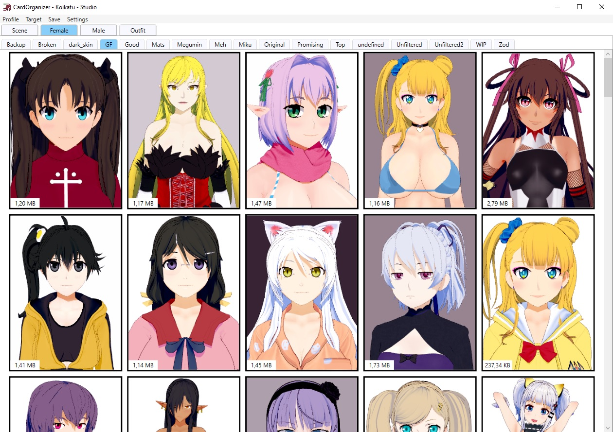

# CardOrganizerWPF
Card organizer for games made by Illusion.

Use at your own risk, nothing should happen to your cards or anything else but please make backups for my sanity.  
Currently supports Koikatu, Honey Select and PlayHome cards, though PlayHome support is very lacking at the moment.

## Installation
1. Make sure BepInEx is installed on your game.
2. Download the latest release from [here](https://github.com/Keelhauled/CardOrganizerWPF/releases).
3. Drop the dll files you want into the `BepInEx` folder inside your game folder.
4. Run CardOrganizerWPF.exe from any folder.
5. Choose the UserData folder from the game you want to manage.

## Usage instructions
The card organizer has to be started before the game since it runs the messaging server. Only the Koikatu plugin can connect to the server manually using ConfigurationManager at the moment.  
Change target to choose which scene to send the card to.  
Context menus on the cards and the categories can be used to load/replace/delete and otherwise manage everything.

#### Shortcuts
Hold left control and click on a category to select it and then hold lctrl and click on cards to move them to that category.  
When dragging cards into the program the cards are copied by default. Holding left shift lets you move them instead.

## Known issues
- Cards get mixed up if the game profile is switched when the program is still loading cards
